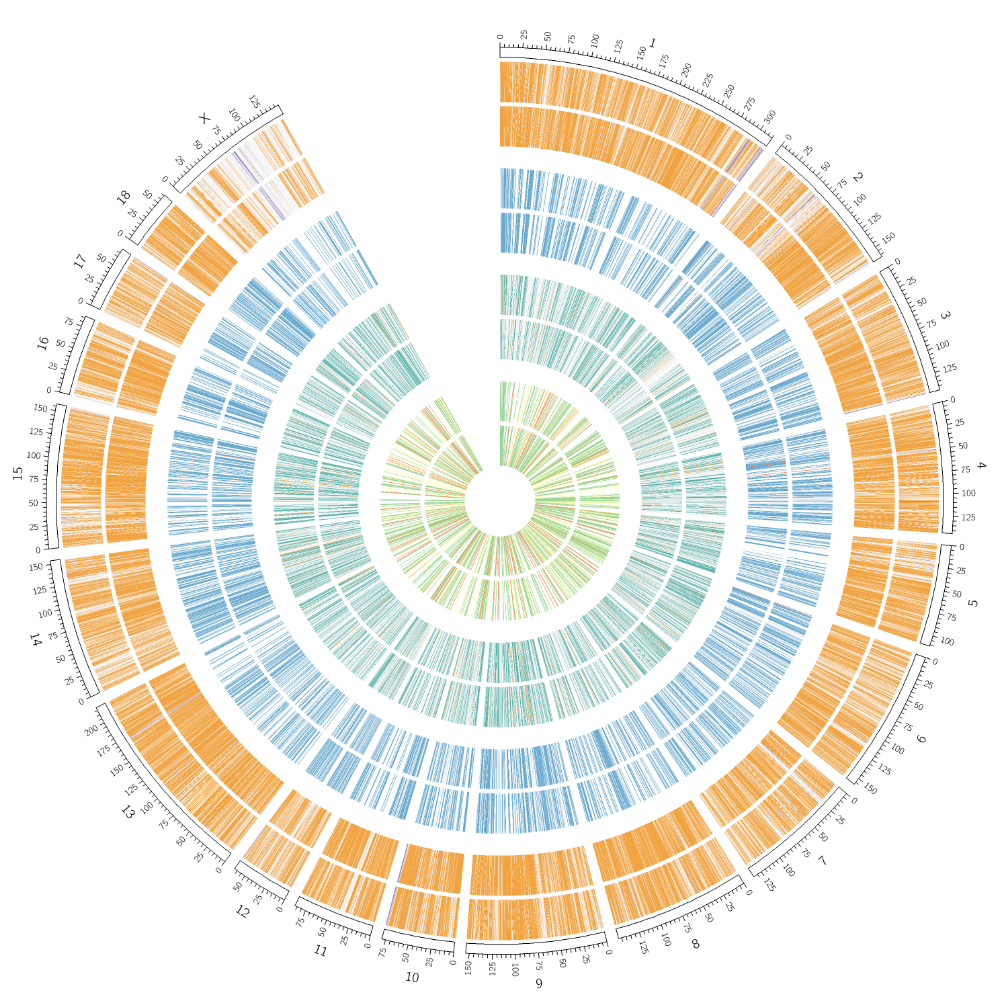
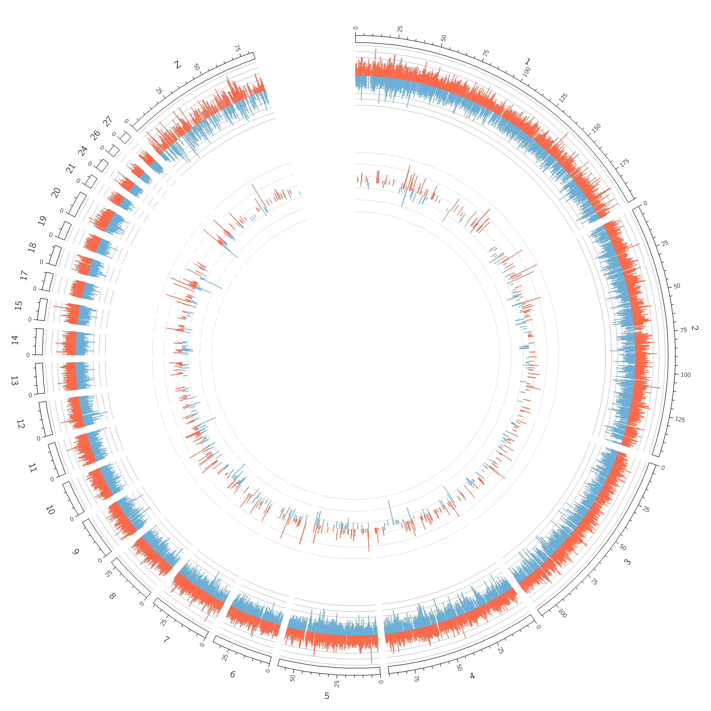
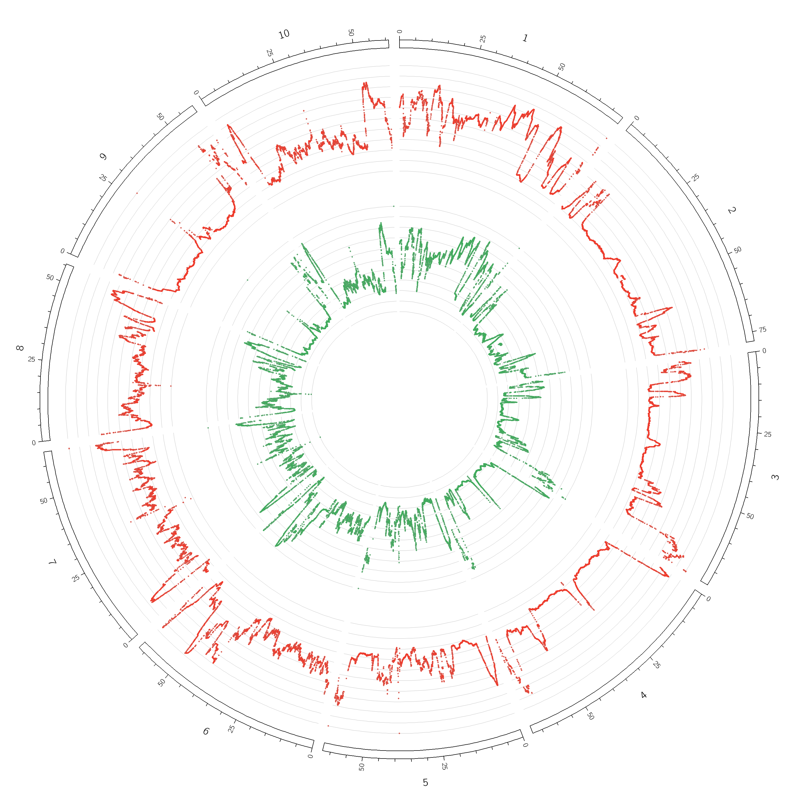

## circos_plot
circos plot 是一个用于快速生成 [circos](http://circos.ca/) 的 python 脚本。目前可以画出 heatmap,hist 和 scatter 类型的简单 cirocs。

## run and params
首先在 circos_info.json 下填写生成 circos 的基本参数,然后再运行:
```sh
python manager.py output_path --axes --pairwise hs1 hs2 150u
```
参数:
* output_path: 生成 circos plot 的目录;
* axes: 可选参数,是否画出坐标轴;
* pairwise: 可选参数,circos 是否有开口,chr1 和 chr2 之间画一个默认 100u 的开口;

## example
**heatmap**


**hist**


**scatter**

